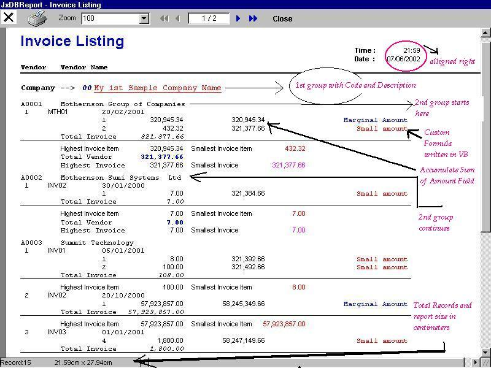



## JxDBReport Writer \- A Report Writer For MS SQL, Ms Access and Oracle Update \(8th June\)

### Description

This is the Report writer tool with Help about the Report writer Objects and their properties. I tried to make the help file as a reference for Programming the Report writer.

The help file, which I submitted as a different submission on 8th June is being remove for Modifcation. Now I'm incorporating All the Features that a report writer can have. Please Wait for Next submission, Which I'll make within couple of days.

 

the Brief information about writer:

The Report Writer has Four Main Objects

1) Page Header

2) Page Footer

3) Groups

4) Items

Items Can be A label, a Line , A database Column value. you can change the Color of a displayed item , its font, Its Alignment. In fact, It can fulfill the purpose of a medium sized Project with 1 million rows or more.

I've Checked the benchmark of the JXDBReport writer using BiBLO.MDB

with a query which returns 16856 rows. The total time to create all the 457 pages

It takes only 9 secs in COMPAQ P-III 800 128MB machine.

This time includes Database connections also.

Check it out. I hope you will like it .

Please Vote for me .
 
### More Info
 

             |
---                |---
**Submitted On**   |2002-06-08 16:49:46
**By**             |[joyprakash saikia](https://github.com/Planet-Source-Code/PSCIndex/blob/master/ByAuthor/joyprakash-saikia.md)
**Level**          |Advanced
**User Rating**    |5.0 (165 globes from 33 users)
**Compatibility**  |VB 5\.0, VB 6\.0
**Category**       |[Complete Applications](https://github.com/Planet-Source-Code/PSCIndex/blob/master/ByCategory/complete-applications__1-27.md)
**World**          |[Visual Basic](https://github.com/Planet-Source-Code/PSCIndex/blob/master/ByWorld/visual-basic.md)
**Archive File**   |[JxDBReport985446252002\.zip](https://github.com/Planet-Source-Code/joyprakash-saikia-jxdbreport-writer-a-report-writer-for-ms-sql-ms-access-and-oracle-update__1-35607/archive/master.zip)

